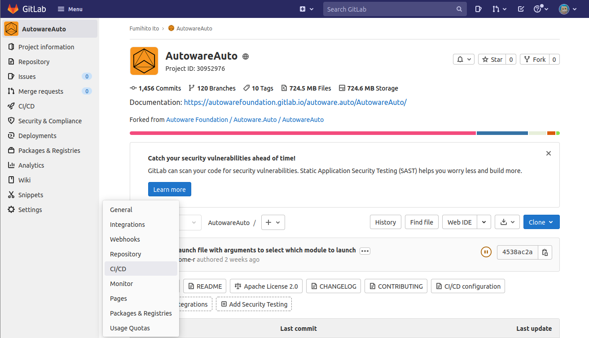
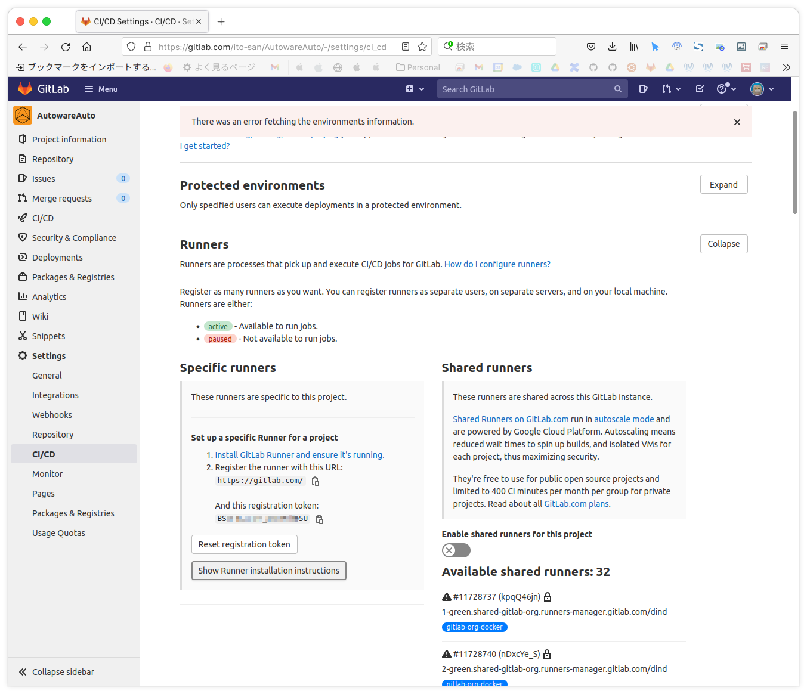
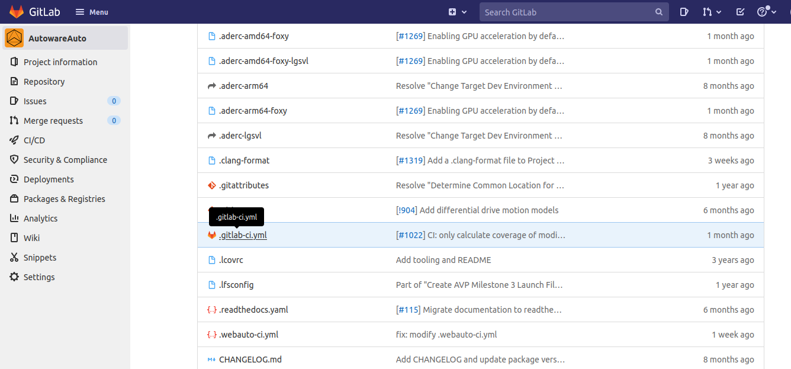
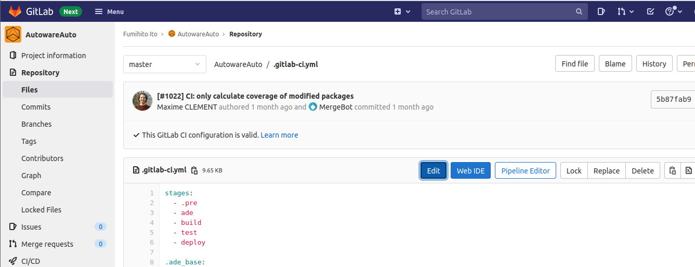
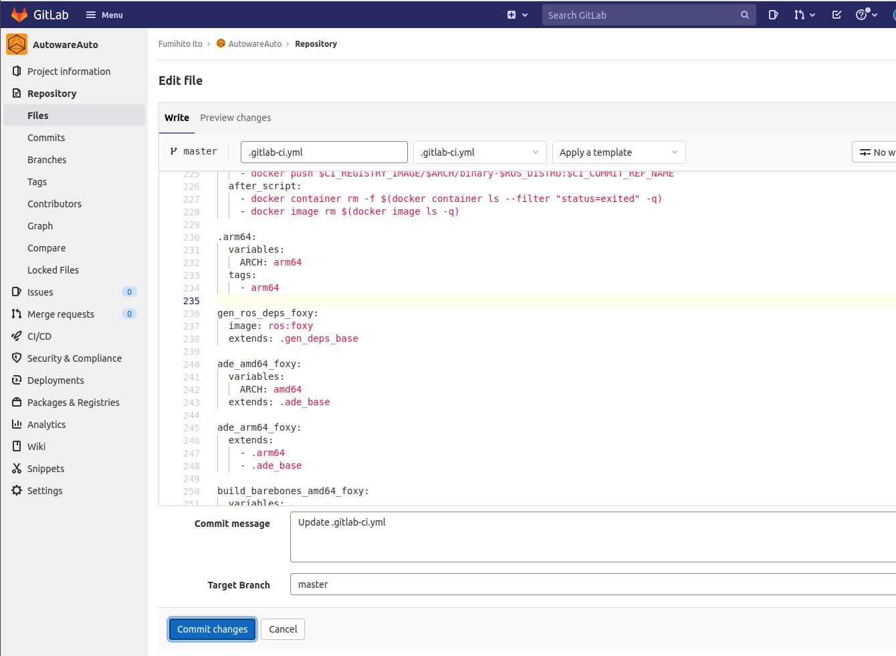
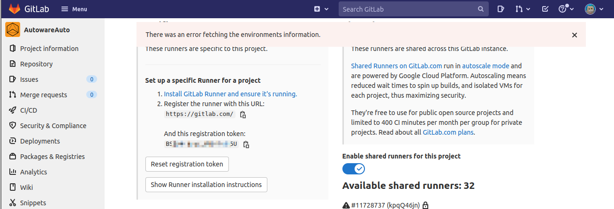
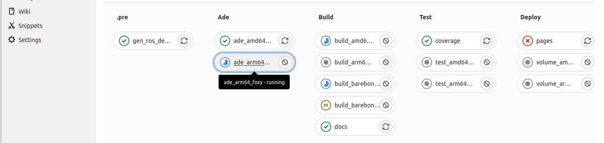

# Setup CI/CD pipeline

## Overview

**On AVA platform, Autoware.Auto needs to run on docker container, and docker image can be easily created by using GitLab CI/CD pipeline.**

**This instruction explains how to setup CI/CD pipeline to create docker image for AVA platform.**

## Refer to the instructions how to create GitLab Runner

GitLab Runner is the agent that runs CI/CD jobs.
There is no public shared runner for arm64, so we need to create specific runner.

1. Press `Settings` -> `CI/CD`.

   

1. Press `Expand` in `Runners`.

   

1. Click `Show Runner installation instructions`.

   

1. Choose `arm64` form `Architecture`, You can refer to the instructions how to install runner.

   

## Install GitLab Runner on AVA platform

You can create GitLab Runner for arm64 on AVA platform by following the almost same procedure as above

1. Download the binary for your system.

   ```console
   wget https://gitlab-runner-downloads.s3.amazonaws.com/latest/binaries/gitlab-runner-linux-arm64 -O /usr/bin/gitlab-runner
   ```

1. Give it permissions to execute.

   ```console
   chmod +x /usr/bin/gitlab-runner
   ```

1. Create a GitLab CI user.

   ```console
   useradd --comment 'GitLab Runner' --create-home gitlab-runner --shell /bin/bash
   ```

1. Install and run as service

   ```console
   gitlab-runner install --user=gitlab-runner --working-directory=/home/gitlab-runner
   ```

## Register specific runner for arm64 on AVA platform

```text
Register specific runner for arm64 on AVA platform
```

Supply information by following prompts.

1. `https://gitlab.com`
1. `registration token` shown in GitLab page
1. `autoware-arm-runner`
1. `arm64`
1. `docker`
1. `alpine:latest`

```text
Enter the GitLab instance URL (for example, https://gitlab.com/):
https://gitlab.com
Enter the registration token:
BS????????????????5U
Enter a description for the runner:
[comhpc]: autoware-arm-runner
Enter tags for the runner (comma-separated):
arm64
Registering runner... succeeded                     runner=BSXc4-ku
Enter an executor: docker, docker-ssh, parallels, ssh, kubernetes, custom, shell, virtualbox, docker+machine, docker-ssh+machine:
docker
Enter the default Docker image (for example, ruby:2.6):
alpine:latest
Runner registered successfully. Feel free to start it, but if it's running already the config should be automatically reloaded!
```

## Verify runner

```console
gitlab-runner verify
```

Refresh CI/CD page in GitLab, you can see the runner registered.


## Edit configuration

```console
vi /etc/gitlab-runner/config.toml
```

:speech_balloon: When a CI/CD job for arm64 is started, we will get the following errors.


To workaround this, Edit configuration as follows.

```diff
 [runners.docker]
   tls_verify = false
   image = "alpine:latest"
-  privileged = false
+  privileged = true
   disable_entrypoint_overwrite = false
   oom_kill_disable = false
   disable_cache = false
-  volumes = ["/cache"]
+  volumes = ["/cache", "/var/run/docker.sock:/var/run/docker.sock"]
   shm_size = 0
```

## Change job timeout value

Maybe not related to this topic, CI/CD jobs for amd64 fails due to timeout.


You can change `Timeout` value, then click `Save changes`.


## Trigger CI/CD jobs anytime you want

CI/CD jobs for arm64 will be triggered by creating a branch or tag in Autoware Foundation’s Autoware.Auto, so we need to edit `.gitlab-ci.yml` so that CI/CD jobs for arm64 can be triggered any time we want.

[gitlab-ci.yml · master · Autoware Foundation / Autoware.Auto / AutowareAuto · GitLab](https://gitlab.com/autowarefoundation/autoware.auto/AutowareAuto/-/blob/master/.gitlab-ci.yml#L230-L237)


1. In your project, Edit `.gitlab-ci.yml` directly on the web, Click `.gitlab-ci.yml`

   

1. Click `Edit`.

   

1. Remove `only` section.

   

1. Then Click Commit changes.

   

## Run CI/CD jobs

1. Enable shared runners.
   

1. CI/CD jobs start, Click `CI/CD` -> `Pipelines`.
   

1. Click Pipeline ID currently running.
   

1. New pipeline is created and jobs for arm64 are entried.
   

   Jobs for arm64 are pending.
   

1. Start GitLab Runner on AVA platform.

   ```console
   gitlab-runner start
   ```

   Then, Jobs for arm64 are started.
   
