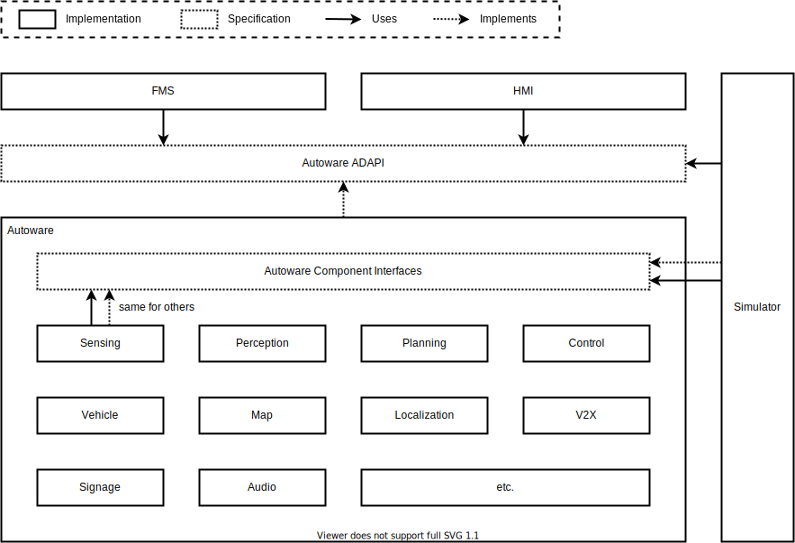
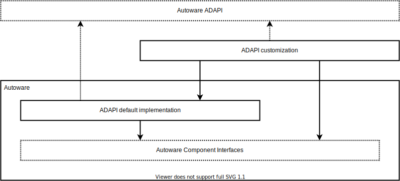

# Autoware API

## Overview

Autoware API provides long-term and stable operation protocol for autonomous driving vehicles, and clarifies how to support new sensors and vehicles and add new features.
It also works as a framework for easy access to the functions of each component by developers of other components.

## Concept

There are two categories of Autoware API.
One is Autoware AD API for operating the vehicle from outside the autonomous driving system such as Fleet Management System(FMS) and HMI for operators or passengers.
The other is Autoware Component Interfaces for linking each internal component.
Some external systems for evaluation or debugging purposes, such as simulator, are allowed access to Component Interfaces in addition to AD API.

## AD API Customization

For general usage, Autoware provides default AD API implementations and configurations using Component Interfaces.
If special behavior is needed, the implementation can be modified as long as it satisfy the requirements of the specification.

## Component Interfaces Hierarchy

Autoware Component Interfaces has a hierarchical specification.
The top-level architecture consists of several components, and each component has some options of the next-level architecture.
Developers select one of them when implementing the component. The simplest next-level architecture is monolithic.
This is an all-in-one and black box implementation, and is suitable for small group development, prototyping, and extremely complex functions.
Others are just concepts and do not currently exist. However, these have advantages for large group development.
Developers can combine their modules with other modules that adopt the same architecture.

## Interface Code Generation

For specification clarification and development efficiency, it is recommended to use generated code by the defined interface.
Developers selects the interface to use from the specification and refers the generated code in their program.
This makes it easy to analyze the interface used by each program, which can be applied to configuration automation and visualization.

